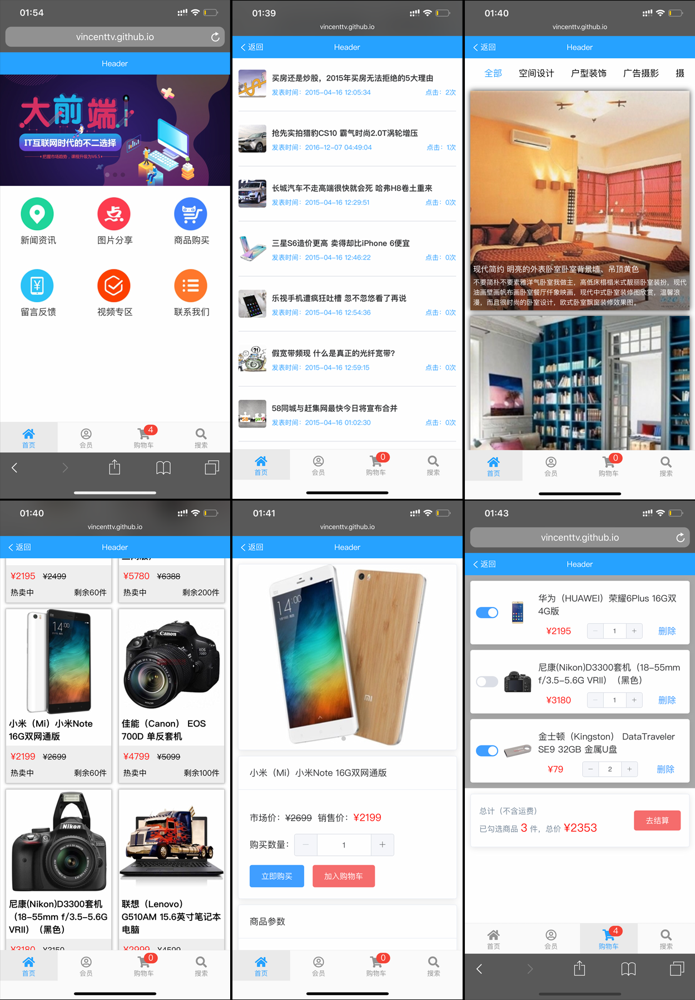

# Vue移动端项目

> 此项目是由 vue 构建的移动端单页面应用，所有API接口及数据都由真实服务器提供。

## 技术栈

* Vue2 + vue-router + vue-resource + vuex 
* ES6 + scss + element-ui

## 效果预览

#### 已实现页面及功能列表

- [x] 首页
- [x] 首页/新闻资讯（新闻列表、详情、评论）
- [x] 首页/图片分享（图片分类列表、评论）
- [x] 首页/商品购买（商品列表、图文介绍、评论、添加购物车）
- [x] 购物车（购物车商品显示、增减、价格统计）

#### 预览

* [预览链接请戳这里](https://vincenttv.github.io/vue-project/dist)（PC端请在手机模式预览）

* 手机端也可扫描下方二维码预览


## 运行

``` bash
# 起步
npm install

# 运行 serve with hot reload at localhost:8080
npm run dev

# 打包
npm run build
```

## 目录结构
<pre>
│  .babelrc            # babel编译配置文件
│  .gitignore          # git忽略文件  比如 node_modules
│  LICENSE             # 开源许可
│  package-lock.json   # 项目配置
│  package.json        # 项目配置
│  webpack.config.js   # webpack 配置文件
│  README.md           # 项目说明
│
├─dist                 # 打包生成文件，包括 首页html、打包js、压缩gz文件
│   
└─src
    │  App.vue         # Vue组件入口
    │  index.html      # 首页
    │  main.js         # 启动配置，配置路由，过滤器
    │  routers.js      # 路由配置文件
    │
    ├─components       # 组件
    │    commodity     # 商品相关组件，包括列表、信息、详情、评论
    │    news          # 新闻相关组件，包括新闻列表、详情
    │    photos        # 图片分享相关组件，包括图片列表、详情
    │    subcomponents # 公用子组件，包括评论组件
    │    tabar         # 底栏四个主页面，包括首页、购物车、会员、搜索
    │
    ├─images           # 图片
    │
    └─lib              # 第三方库，主要引用了fontawsome图标
</pre>

## 项目问题及解决方案

1. iPhone X及以上页面滑动底部导航条遮挡问题？</br>
    解决方案：使用 iOS11 新增特性env()和constant()，在body以及fixed元素设置安全区域。</br>
    ```css
    padding-bottom: constant(safe-area-inset-bottom); /* 兼容 iOS < 11.2 */
    padding-bottom: env(safe-area-inset-bottom); /* 兼容 iOS >= 11.2 */
    ```
    参考文档：[Designing Websites for iPhone X](https://webkit.org/blog/7929/designing-websites-for-iphone-x/)

*** 

2. https 页面请求 http 接口导致【Mixed Content】问题？</br>
    问题说明：由于API接口不是我写的，我也动不了别人的服务器，所以不能直接将API接口启用 https。</br>
    解决方案：利用 JsonBird 接口代理。</br>
    参考文档：[JsonBird](https://bird.ioliu.cn/)

## 部分页面截图


